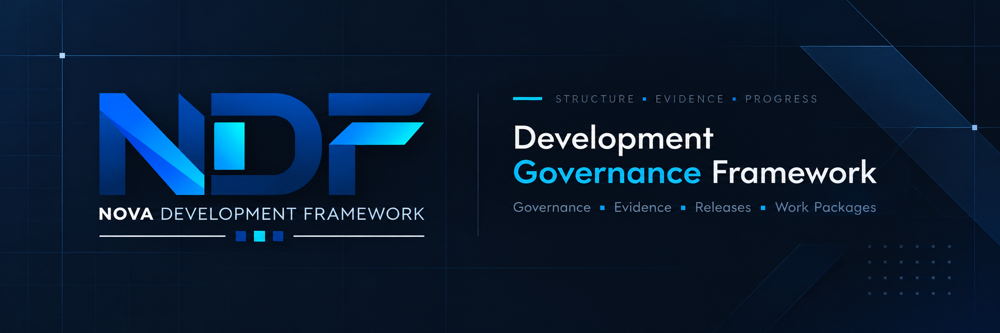

<p align="center">
  
</p>

<h1 align="center">Nova Development Framework (NDF)</h1>

<p align="center">
  <a href="docs/release/V1_1_0_RELEASE_NOTES.md"></a>
  <a href="LICENSE"></a>
  <a href="docs/repository/PUBLIC_QUALITY_GATE.md"></a>
  <a href=".claude/skills/README.md"></a>
  <a href="docs/adr/ADR-0031-v1x-compatibility-policy.md"></a>
</p>

<p align="center"><strong>Human-led · AI-assisted · Documentation-first · Security-first</strong></p>

**DE:** NDF ist ein projektneutrales Framework, mit dem Softwareprojekte KI-gestützt geplant, gebaut und gepflegt werden — dokumentationsgetrieben, Security-first und unter durchgehender menschlicher Kontrolle.

**EN:** NDF is a project-neutral framework for planning, building and maintaining software projects with AI assistance — documentation-first, security-first and under continuous human control.

## Contents / Inhalt

- **Start:** [What is NDF?](#what-is-ndf--was-ist-ndf) · [Quick Start](#quick-start--schnellstart) · [Why NDF?](#why-ndf--warum-ndf)
- **Concepts / Konzepte:** [How NDF Works](#how-ndf-works--so-funktioniert-ndf) · [Core Principles](#core-principles--kernprinzipien) · [Roles & Authority](#roles--authority--rollen--autorität)
- **Working with NDF / Arbeiten mit NDF:** [Work Packages](#work-packages) · [Skills & Context Economy](#skills--context-economy) · [Project Adapter](#project-adapter) · [Security & Safety](#security--safety) · [Validation & Evidence](#validation--evidence--validierung--evidenz)
- **Reference / Referenz:** [Current Release](#current-release--aktuelles-release) · [Documentation Map](#documentation-map--dokumentationsübersicht) · [Repository Structure](#repository-structure--repository-struktur) · [Language](#language--sprache) · [Contributing & Feedback](#contributing--feedback--mitwirken--feedback) · [License](#license--lizenz)

## What is NDF? / Was ist NDF?

**DE:** NDF ist ein dokumentationsbasiertes Framework für KI-gestützte Softwareentwicklung. Standards, Vorlagen, Prompts und docs-only Skills legen fest, wer plant, wer umsetzt und wer entscheidet — und wie Arbeit in kleine, typisierte Work Packages zerlegt, dokumentiert und geprüft wird. NDF ist weder Laufzeitumgebung noch Paket: Es wird angewendet, indem man seine Dokumente liest und befolgt.

**EN:** NDF is a documentation-based framework for AI-assisted software development. Standards, templates, prompts and docs-only Skills define who plans, who executes and who decides — and how work is cut into small, typed Work Packages that are documented and reviewed. NDF is neither a runtime nor a package: you apply it by reading and following its documents.

## Quick Start / Schnellstart

**DE:** NDF definiert kein Installationskommando — der Einstieg führt über Dokumente. Neu hier? Mit Pfad **A** beginnen.

**EN:** NDF defines no install command — you start from its documents. New here? Begin with path **A**.

| Path / Pfad | Goal / Ziel | Start here / Einstieg | Next / Danach |
|---|---|---|---|
| **A** | Understand NDF / NDF verstehen | [NDF Practical Workflow](docs/workflow/NDF_PRACTICAL_WORKFLOW.md) | [Roles & Responsibilities](docs/workflow/ROLES_AND_RESPONSIBILITIES.md) · [Work Package Lifecycle](framework/standards/WORK_PACKAGE_LIFECYCLE.md) |
| **B** | Use NDF with an existing project / NDF in einem bestehenden Projekt nutzen | [Project Adapter v0.2](docs/project-starter/PROJECT_ADAPTER_V0_2.md) | [Example fixture](examples/neutral-example-project/README.md) · new project / neues Projekt: [New Project Flow](docs/project-starter/NEW_PROJECT_FLOW.md) |
| **C** | Create and run Work Packages / Work Packages erstellen und durchführen | [Work Package Standard](docs/workflow/WORK_PACKAGE_STANDARD.md) | [Work Package Types](framework/standards/WORK_PACKAGE_TYPES.md) · [Lean Work Package prompt template](docs/templates/LEAN_WP_PROMPT_TEMPLATE.md) · [Execution Contract](framework/prompts/blocks/BLOCK_EXECUTION_CONTRACT.md) |
| **D** | Use NDF Skills / NDF Skills nutzen | [Skills Pack](.claude/skills/README.md) | [Skill Security Policy](docs/agent-workflows/NDF_SKILL_SECURITY_POLICY.md) · [Context budgets](docs/guides/TOKEN_EFFICIENCY_AND_CONTEXT_BUDGET_BASELINE.md) |

## Why NDF? / Warum NDF?

**DE:** KI-gestützte Entwicklung ist schnell, wird aber leicht unstrukturiert: Reviews werden zu ungeplanten Umbauten, Features entstehen ohne Dokumentation, riskante Funktionen ohne Schutzmaßnahmen — und Agenten handeln über ihren Auftrag hinaus. NDF setzt dem kleine, typisierte Work Packages, getrennte Rollen für Planung, Umsetzung und Entscheidung sowie verpflichtende Sicherheitsmuster entgegen. Das Ziel: nachvollziehbare Änderungen, klare Verantwortung und ehrlich sichtbare Grenzen.

**EN:** AI-assisted development is fast but easily becomes unstructured: reviews turn into unplanned rewrites, features ship without documentation, risky functionality gets built without safeguards — and agents act beyond their mandate. NDF counters this with small, typed Work Packages, separate roles for planning, execution and decision, and mandatory safety patterns. The aim: traceable changes, clear accountability and honestly visible limits.

## How NDF Works / So funktioniert NDF

```text
PLAN → EXECUTE → VERIFY → EVALUATE
                               │
                               └─ Human Maintainer Gate / Decision
                                  where authority is required
```

| Governed Loop | DE | EN |
|---|---|---|
| **PLAN** | Nova (ChatGPT) klassifiziert den Bedarf und schreibt einen vollständigen Work-Package-Prompt: Typ, Scope, erlaubte Dateien, Akzeptanzkriterien. | Nova (ChatGPT) classifies the need and writes one complete Work Package prompt: type, scope, allowed files, acceptance criteria. |
| **EXECUTE** | Der Implementation Agent arbeitet ausschließlich im freigegebenen Scope. | The Implementation Agent works strictly inside the authorised scope. |
| **VERIFY** | Der Agent prüft sein Ergebnis (Selbstprüfung, Public Quality Gate) und berichtet strukturiert an Nova. | The agent checks its result (self-checks, Public Quality Gate) and reports to Nova in a structured format. |
| **EVALUATE** | Nova gibt ein Review-Votum ab, z. B. GO, GO WITH NOTES, REWORK oder STOP — eine Bewertung, keine Annahme. | Nova issues a review verdict such as GO, GO WITH NOTES, REWORK or STOP — an evaluation, not an acceptance. |

**Human Maintainer Gate**

**DE:** Das Gate ist kein fünfter Schritt des Governed Loop, sondern die Autoritätsgrenze: Wo Autorität erforderlich ist, entscheidet allein der Human Maintainer — Annahme oder Ablehnung, Staging, Commit, Push, Tag und Release. Ein Nova-Review ist keine menschliche Annahme (`NOVA_REVIEW != HUMAN_ACCEPTANCE`); KI-Ausführung schafft keine normative Annahme (`EXECUTED != ACCEPTED`).

**EN:** The gate is not a fifth stage of the Governed Loop but the authority boundary: where authority is required, only the Human Maintainer decides — acceptance or rejection, staging, commit, push, tag and release. A Nova review is not human acceptance (`NOVA_REVIEW != HUMAN_ACCEPTANCE`); AI execution creates no normative acceptance (`EXECUTED != ACCEPTED`).

Detailed steps / Detaillierte Schritte — [Work Package Lifecycle](framework/standards/WORK_PACKAGE_LIFECYCLE.md):

```text
Intake → Classification → Blueprint/Prompt → Execution → Report to Nova (Rückmeldung) → Nova Review → Maintainer Commit → CI/Validation → Follow-up
```

## Core Principles / Kernprinzipien

| Principle | DE | EN |
|---|---|---|
| **Documentation First** | Wichtige Entscheidungen werden dokumentiert, bevor sie dauerhaft werden. | Important decisions are documented before they become permanent. |
| **Architecture First** | Komplexe Arbeit wird erst geplant, dann umgesetzt. | Complex work is planned before it is implemented. |
| **AI creates. Humans approve.** | KI trifft keine irreversiblen Entscheidungen. | AI never makes irreversible decisions. |
| **Small, typed Work Packages** | Kein Work Package ohne deklarierten Typ. | No Work Package without a declared type. |
| **Security first, fail closed** | Riskante Funktionen brauchen explizite Sicherheitsmuster. | Risky functionality requires explicit safety patterns. |
| **Continuous feedback** | Validierte Erfahrung fließt zurück ins Framework. | Validated experience flows back into the framework. |

Further principles / Weitere Prinzipien: [NDF Principles v1](docs/principles/NDF_PRINCIPLES.md) (DE)

## Roles & Authority / Rollen & Autorität

| Role | DE | EN |
|---|---|---|
| **Nova (ChatGPT)** | Nova (ChatGPT) – die ChatGPT-basierte Planungs-, Architektur- und Review-Rolle. Spezifiziert Work Packages und gibt Review-Voten ab. | Nova (ChatGPT) – the ChatGPT-based planning, architecture and review role. Specifies Work Packages and issues review verdicts. |
| **Implementation Agent** (z. B. / e.g. Claude) | Führt genau ein Work Package im freigegebenen Scope aus und berichtet strukturiert an Nova. | Executes exactly one Work Package within the authorised scope and reports back to Nova in a structured format. |
| **Human Maintainer** | Letzte Instanz: normative Annahme, Scope-Änderungen und Annahme von Architecture Decision Records (ADRs); führt Staging, Commit, Push, Tag und Release aus. | Final owner: normative acceptance, scope changes and acceptance of Architecture Decision Records (ADRs); performs staging, commit, push, tag and release. |

> [!IMPORTANT]
> **DE:** KI-Rollen führen kein Staging, keinen Commit, keinen Push, kein Tagging und kein Release aus. Ein Review-Votum von Nova ist eine Bewertung, keine Annahme.
>
> **EN:** AI roles do not stage, commit, push, tag or release. A Nova review verdict is an evaluation, not an acceptance.

### Authority invariants / Autoritäts-Invarianten

```text
DERIVE != DECLARE
VERIFY != APPROVE
EVIDENCE != AUTHORITY
EXECUTED != ACCEPTED
AGENT_COMPLETE != HUMAN_APPROVED
NOVA_REVIEW != HUMAN_ACCEPTANCE
READY != RELEASED
PASS != PROMOTED
PREPARED != AUTHORIZED
```

**DE:** Kein abgeleiteter Status, kein Prüfergebnis, kein Nachweis und keine Fertigmeldung eines Agenten ersetzt die Entscheidung des Human Maintainers.

**EN:** No derived status, check result, piece of evidence or agent completion replaces the Human Maintainer's decision.

Details: [Execution Contract](framework/prompts/blocks/BLOCK_EXECUTION_CONTRACT.md) · [Roles & Responsibilities](docs/workflow/ROLES_AND_RESPONSIBILITIES.md) · [Nova (ChatGPT) role](docs/workflow/NOVA_CHATGPT_ROLE.md)

## Work Packages

**DE:** Arbeit wird in Work Packages zerlegt, jedes mit genau einem primären Typ; der Typ bestimmt erlaubte Änderungen, Testerwartung und Review-Tiefe. Der Prompt ist ein vollständiger, eigenständiger Vertrag — mit Execution Header (`SESSION`, `STATUS`), Scope, erlaubten und verbotenen Dateien, STOP-Bedingungen und Akzeptanzkriterien. Korrekturen kommen als `COMPLETE REPLACEMENT`, nie als Delta.

**EN:** Work is cut into Work Packages, each with exactly one primary type; the type decides allowed changes, test expectations and review depth. The prompt is one complete, self-contained contract — with an execution header (`SESSION`, `STATUS`), scope, allowed and forbidden files, STOP conditions and acceptance criteria. Corrections arrive as a `COMPLETE REPLACEMENT`, never as a delta.

Types (examples) / Typen (Beispiele): `review-only` · `docs-only` · `code-fix` · `feature` · `test-only` · `security-baseline` · `security-code-fix` · `release-prep` · `destructive-blueprint` · `destructive-implementation` · `project-adapter`

Details: [Work Package Types](framework/standards/WORK_PACKAGE_TYPES.md) · [Work Package Standard](docs/workflow/WORK_PACKAGE_STANDARD.md) · [Work Package template](framework/templates/NDF_WORK_PACKAGE_TEMPLATE.md)

## Skills & Context Economy

### Skills

**DE:** Der Skills Pack (`.claude/skills/`) enthält **38 docs-only Skills** — ein Werkzeugkasten, kein Dauerkontext. Pro Work Package werden nur passende Skills gewählt, bevorzugt 0–3 Support-Skills über den Router `ndf-work-package-runner`; der gesamte Pack wird nie standardmäßig aktiviert. Alle Skills sind fail-closed (ADR-0032): ohne Scripts, Netzwerk, Secrets oder Git-/Release-Aktionen. Readiness- und Release-Arbeit nach v1.0 nutzt `ndf-release-safety` und `ndf-release-notes-runner`; `ndf-v1-readiness-review` ist historisch.

**EN:** The Skills Pack (`.claude/skills/`) holds **38 docs-only Skills** — a toolbox, not permanent context. Each Work Package selects only the Skills it needs, preferably 0–3 support skills via the `ndf-work-package-runner` router; the whole pack is never activated by default. All Skills are fail-closed (ADR-0032): no scripts, network, secrets or Git/release actions. Readiness and release work after v1.0 uses `ndf-release-safety` and `ndf-release-notes-runner`; `ndf-v1-readiness-review` is historical.

> [!NOTE]
> **DE:** Die Nutzung der Skills in privaten Consumer-Projekten liegt außerhalb des aktuellen Scopes von ADR-0032 und bleibt eine offene, zurückgestellte Entscheidung (Kandidat ADR-0033).
>
> **EN:** Using the Skills in private consumer projects is outside ADR-0032's current scope and remains an open, deferred decision (candidate ADR-0033).

Details: [Skills Pack](.claude/skills/README.md) · [ADR-0032 — Skill Security Policy](docs/adr/ADR-0032-skill-security-policy.md) · [Skill Security Policy (operational rules)](docs/agent-workflows/NDF_SKILL_SECURITY_POLICY.md)

### Context Economy

**DE:** Context Economy heißt: nur den Kontext laden, den Aufgabe, Security und Review brauchen — Sparen an Ballast, nicht an Sorgfalt. Kontextbudgets **B0–B4** skalieren den Aufwand; **B1 Lean** ist der bevorzugte Normalfall, B4 eine begründete Ausnahme, nie Standard. Die Profile Lean, Handoff, Review-only und Fix ergänzen die Prompt Modes Full, Standard und Short; Full bleibt Pflicht für Release, ADR, Security Policy, v1.x-Kompatibilität und komplexe Reviews.

**EN:** Context Economy means loading only the context that the task, its security and its review need — saving on ballast, not on diligence. Context budgets **B0–B4** scale the effort; **B1 Lean** is the preferred normal case, B4 a justified exception, never a standard. The Lean, Handoff, Review-only and Fix profiles refine the Full, Standard and Short prompt modes; Full stays mandatory for release, ADR, security policy, v1.x compatibility and complex reviews.

Details: [NDF Context Economy](docs/agent-workflows/NDF_CONTEXT_ECONOMY.md) · [NDF Prompt Modes](docs/agent-workflows/NDF_PROMPT_MODES.md) · [Token Efficiency & Context Budget Baseline](docs/guides/TOKEN_EFFICIENCY_AND_CONTEXT_BUDGET_BASELINE.md)

## Project Adapter

**DE:** Der Project Adapter v0.2 führt ein bestehendes Projekt strukturiert in NDF über — ohne Neustart und ohne riskante Umbauten. Er beginnt read-only: Intake und Repository-Review (Phase 0–1) ändern weder Code noch Konfiguration. Was der Implementation Agent vorbereitet, ist **PREPARED**; erst was der Human Maintainer bestätigt — Ziele, Sicherheits-Ausschlüsse, Public/Private-Status — ist **AUTHORIZED**. Die Autorität bleibt damit beim Human Maintainer.

**EN:** Project Adapter v0.2 brings an existing project into NDF in a structured way — no restart, no risky rework. It starts read-only: intake and repository review (phases 0–1) change neither code nor configuration. What the Implementation Agent prepares is **PREPARED**; only what the Human Maintainer confirms — goals, safety exclusions, public/private status — is **AUTHORIZED**. Authority therefore stays with the Human Maintainer.

Details: [Project Adapter v0.2](docs/project-starter/PROJECT_ADAPTER_V0_2.md) · [Project Adapter Conventions](docs/project-starter/PROJECT_ADAPTER_CONVENTIONS.md) · [Existing Project Flow](docs/project-starter/EXISTING_PROJECT_FLOW.md) · [Example fixture](examples/neutral-example-project/README.md)

## Security & Safety

**DE:** NDF ist Security-first und fail-closed: Was ein Work Package nicht ausdrücklich erlaubt, ist verboten; Unklares wird gestoppt und eskaliert, nicht geraten. Irreversible oder destruktive Funktionen (Löschen, Bulk-Operationen) entstehen nie direkt: erst ein `destructive-blueprint`, nach Freigabe die `destructive-implementation` — mit strikter Validierung, Read-only-Preview, Owner-only-Autorisierung, Backup vor dem Löschen und Audit-Logging. Riskante Git-Operationen bleiben unter menschlicher Kontrolle, Secrets werden nie committet, und kein Nachweis ersetzt eine Freigabe (`EVIDENCE != AUTHORITY`).

**EN:** NDF is security-first and fails closed: whatever a Work Package does not explicitly allow is forbidden; unclear cases are stopped and escalated, never guessed. Irreversible or destructive functionality (deletion, bulk operations) is never built directly: first a `destructive-blueprint`, then — after approval — the `destructive-implementation`, with strict validation, read-only preview, owner-only authorization, backup-before-delete and audit logging. High-risk Git operations stay under human control, secrets are never committed, and no evidence replaces an approval (`EVIDENCE != AUTHORITY`).

Details: [SECURITY.md](SECURITY.md) · [Destructive Action Toolkit](docs/toolkit/destructive-actions/DESTRUCTIVE_ACTION_TOOLKIT.md) · [Security Prompt Library](docs/toolkit/security-prompts/SECURITY_PROMPT_LIBRARY.md) · [Git Safety Standard](docs/workflow/GIT_SAFETY_STANDARD.md)

## Validation & Evidence / Validierung & Evidenz

**DE:** NDF wurde an zwei realen Referenzprojekten validiert und durch unabhängige sowie agentengestützte Adapter-Validierungsläufe ergänzt. Nachweise werden nach Quelle und Stärke eingeordnet und nie mit Autorität verwechselt (`VERIFY != APPROVE`). Grenzen bleiben sichtbar: G-13 (Evidenztiefe externer Validierung) ist `MATERIALLY_REDUCED`, nicht geschlossen.

**EN:** NDF was validated against two real reference projects and complemented by independent and agent-executed adapter validation runs. Evidence is classified by source and strength and never mistaken for authority (`VERIFY != APPROVE`). Limits stay visible: G-13 (external validation evidence depth) is `MATERIALLY_REDUCED`, not closed.

**DE:** Der Public Quality Gate prüft öffentliche Neutralität, Root-Hygiene, History-Trennung und die README-Basisstruktur — in CI bei jedem Pull Request und Push auf `main`, lokal per Script. Die Denylist privater Begriffe liegt nie im Repository.

**EN:** The Public Quality Gate checks public neutrality, root hygiene, history separation and the README baseline — in CI on every pull request and push to `main`, locally via script. The denylist of private terms is never stored in the repository.

```bash
python scripts/check_public_quality.py --self-test
python scripts/check_public_quality.py --strict
```

Details: [Public Quality Gate](docs/repository/PUBLIC_QUALITY_GATE.md) · [Real Project Validation Overview](docs/validation/REAL_PROJECT_VALIDATION_OVERVIEW.md) · [Independent Adapter Validation Runbook](docs/validation/project-adapter/INDEPENDENT_ADAPTER_VALIDATION_RUNBOOK.md) · [External Validation Improvement](docs/validation/v1-1/EXTERNAL_VALIDATION_IMPROVEMENT.md)

## Current Release / Aktuelles Release

| Item / Punkt | Status |
|---|---|
| Latest release / Neuestes Release | `v1.1.0` — 2026-09-23 · minor release, not a pre-release / Minor Release, kein Pre-Release |
| Release decision / Release-Entscheidung | `GO_WITH_NOTES` — Human Maintainer, 2026-09-23 |
| Compatibility / Kompatibilität | v1.x promise active since `v1.0.0` ([ADR-0031](docs/adr/ADR-0031-v1x-compatibility-policy.md)), no breaking change / v1.x-Zusage aktiv seit `v1.0.0`, kein Breaking Change |
| Skills | 38 docs-only Skills — none added, removed or renamed / keiner hinzugefügt, entfernt oder umbenannt |
| Previous final release / Vorheriges finales Release | [`v1.0.0`](docs/release/V1_0_FINAL_RELEASE_NOTES.md) — 2026-07-10 |

> [!NOTE]
> **DE:** `GO_WITH_NOTES` ist kein reines `GO`: Bekannte Grenzen gehen ungelöst und sichtbar in `v1.1.0` mit. Dazu gehört **G-13 (Evidenztiefe externer Validierung): `MATERIALLY_REDUCED` — nicht geschlossen.** Die Tiefe wurde adressiert, die Unabhängigkeit nicht; die Schließung erfordert mindestens einen echt unabhängigen Lauf gegen ein Fixture mit Quellcode.
>
> **EN:** `GO_WITH_NOTES` is not a plain `GO`: known limitations are carried into `v1.1.0` unresolved and visible. They include **G-13 (external validation evidence depth): `MATERIALLY_REDUCED` — not closed.** Depth was addressed, independence was not; closing it requires at least one genuinely independent run against a code-bearing fixture.

**DE:** Die Historie — `v1.0.0` und die Foundation-Reihe 0.1–0.9 (`v0.1.0-foundation` … `v0.9.0-foundation`) — steht im CHANGELOG und unter `docs/release/`. Git-Tags und GitHub-Releases erstellt ausschließlich der Human Maintainer.

**EN:** The history — `v1.0.0` and the Foundation series 0.1–0.9 (`v0.1.0-foundation` … `v0.9.0-foundation`) — lives in the CHANGELOG and under `docs/release/`. Git tags and GitHub releases are created by the Human Maintainer only.

Current / Aktuell: [v1.1.0 Release Notes](docs/release/V1_1_0_RELEASE_NOTES.md) · [Known Limitations](docs/release/V1_1_0_RELEASE_NOTES.md#known-limitations) · [v1.1.0 Go/No-Go](docs/release/V1_1_0_GO_NO_GO.md) · [v1.1.0 Evidence Index](docs/release/V1_1_0_RELEASE_EVIDENCE_INDEX.md)

History / Historie: [CHANGELOG](CHANGELOG.md) · [Release documents](docs/release/) · [Roadmap documents](docs/roadmap/) · [v1.0 Path Summary](docs/roadmap/V1_0_PATH_SUMMARY.md)

## Documentation Map / Dokumentationsübersicht

| I want to … / Ich möchte … | Start here / Einstieg |
|---|---|
| understand NDF / NDF verstehen | [NDF Practical Workflow](docs/workflow/NDF_PRACTICAL_WORKFLOW.md) · [NDF Principles v1](docs/principles/NDF_PRINCIPLES.md) |
| adopt NDF / NDF einführen | [Project Adapter v0.2](docs/project-starter/PROJECT_ADAPTER_V0_2.md) (existing project / bestehendes Projekt) · [New Project Flow](docs/project-starter/NEW_PROJECT_FLOW.md) |
| create a Work Package / ein Work Package erstellen | [Work Package Standard](docs/workflow/WORK_PACKAGE_STANDARD.md) · [Work Package Types](framework/standards/WORK_PACKAGE_TYPES.md) · [Work Package template](framework/templates/NDF_WORK_PACKAGE_TEMPLATE.md) |
| understand roles / Rollen verstehen | [Roles & Responsibilities](docs/workflow/ROLES_AND_RESPONSIBILITIES.md) · [Nova (ChatGPT) role](docs/workflow/NOVA_CHATGPT_ROLE.md) |
| use Skills and keep context small / Skills nutzen und Kontext klein halten | [Skills Pack](.claude/skills/README.md) · [Skill Security Policy](docs/agent-workflows/NDF_SKILL_SECURITY_POLICY.md) · [Context Budget Baseline](docs/guides/TOKEN_EFFICIENCY_AND_CONTEXT_BUDGET_BASELINE.md) |
| understand security / Security verstehen | [SECURITY.md](SECURITY.md) · [Destructive Action Toolkit](docs/toolkit/destructive-actions/DESTRUCTIVE_ACTION_TOOLKIT.md) · [Security Prompt Library](docs/toolkit/security-prompts/SECURITY_PROMPT_LIBRARY.md) |
| follow governance and ADRs / Governance und ADRs nachvollziehen | [Execution Contract](framework/prompts/blocks/BLOCK_EXECUTION_CONTRACT.md) · [ADR Policy](docs/adr/ADR_POLICY.md) · [ADR overview](docs/adr/README.md) |
| check releases / Releases prüfen | [CHANGELOG](CHANGELOG.md) · [v1.1.0 Release Notes](docs/release/V1_1_0_RELEASE_NOTES.md) |
| check compatibility / Kompatibilität prüfen | [ADR-0031 — v1.x Compatibility Policy](docs/adr/ADR-0031-v1x-compatibility-policy.md) |
| find templates, prompts and examples / Vorlagen, Prompts und Beispiele finden | [Template Index](framework/templates/TEMPLATE_INDEX.md) · [Prompt Index](framework/prompts/PROMPT_INDEX.md) · [Minimal NDF project](examples/minimal-ndf-project/README.md) |

## Repository Structure / Repository-Struktur

```text
Nova-Development-Framework/
├── .claude/skills/        38 docs-only Skills
├── .github/               Public Quality Gate workflow, issue and pull request templates
├── .ndf/                  example file for the local neutrality denylist (real list never committed)
├── academy/               NDF Academy learning material
├── adr/                   early core ADRs (Foundation 0.1 era, frozen)
├── branding/              logo, banner, palette and brand guidelines
├── build/                 example build configurations (MkDocs, Pandoc)
├── docs/                  guides, workflow, ADRs, validation, releases, roadmap
├── examples/              neutral example projects
├── framework/             standards, templates, prompts, checklists
├── github-desktop-guide/  GitHub Desktop guide
├── project-brain/         framework memory: context packs and Work Package notes
├── scripts/               Public Quality Gate, repository safety and cleanup scripts
├── standards/             early standards (parallel folder)
├── templates/             early templates (parallel folder)
├── CHANGELOG.md
├── CODE_OF_CONDUCT.md
├── CONTRIBUTING.md
├── LICENSE
├── README.md
└── SECURITY.md
```

**DE:** Wiederverwendbare Vorlagen und Prompts gehören nach `framework/`; neue ADRs entstehen unter `docs/adr/`.

**EN:** Reusable templates and prompts belong under `framework/`; new ADRs are created under `docs/adr/`.

Details: [Root Directory Policy](docs/repository/ROOT_DIRECTORY_POLICY.md) · [Template and Prompt Location Policy](docs/repository/TEMPLATE_AND_PROMPT_LOCATION_POLICY.md) · [Repository Structure Review](docs/repository/REPOSITORY_STRUCTURE_REVIEW.md)

## Language / Sprache

**DE:** NDF wird zweisprachig geführt (Deutsch/Englisch). Diese README stellt beide Sprachen abschnittsweise nebeneinander; Fachbegriffe wie Work Package, Implementation Agent, Maintainer und Security bleiben englisch. Einzelne verlinkte Dokumente sind noch einsprachig — der Übersetzungsstand ist gemischt und wird offen verfolgt.

**EN:** NDF is maintained bilingually (German/English). This README pairs both languages section by section; technical terms such as Work Package, Implementation Agent, Maintainer and Security stay in English. Some linked documents are still single-language — translation status is mixed and tracked openly.

Details: [DE/EN Language Standard](docs/i18n/DE_EN_LANGUAGE_STANDARD.md) · [Translation Status](docs/i18n/TRANSLATION_STATUS.md)

## Contributing & Feedback / Mitwirken & Feedback

**DE:** Beiträge folgen demselben Modell wie NDF selbst: Ziel klären, Dokumentation zuerst, kleine Schritte, menschliches Review vor jedem Commit. KI darf zuarbeiten, aber nie eigenständig pushen oder veröffentlichen. Sicherheitsprobleme bitte nicht öffentlich machen, bevor sie verstanden sind — siehe [SECURITY.md](SECURITY.md).

**EN:** Contributions follow the same model as NDF itself: clarify the goal, documentation first, small steps, human review before every commit. AI may assist but never pushes or publishes on its own. Please do not disclose security issues publicly before they are understood — see [SECURITY.md](SECURITY.md).

Details: [CONTRIBUTING.md](CONTRIBUTING.md) · [Code of Conduct](CODE_OF_CONDUCT.md) · [Issue templates](.github/ISSUE_TEMPLATE/) · [Pull request template](.github/PULL_REQUEST_TEMPLATE.md)

## License / Lizenz

**DE:** NDF steht unter der [MIT-Lizenz](LICENSE).

**EN:** NDF is licensed under the [MIT License](LICENSE).
